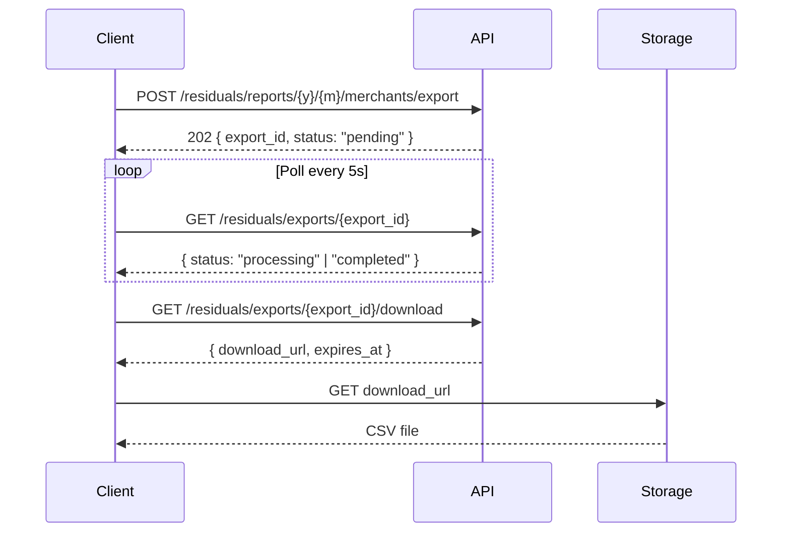

## Overview

For large datasets (like per-merchant residuals), the API supports async exports. You create an export job, poll for completion, then download the file via a signed URL.

## Workflow



## Step 1: Create the export

<CodeGroup>

```python Python
resp = requests.post(
    f"{BASE}/residuals/reports/2026/1/merchants/export",
    headers=HEADERS
).json()

export_id = resp["data"]["export_id"]
print(f"Export created: {export_id}")
```

```bash cURL
curl -X POST -H "X-Partner-API-Key: pk_live_YOUR_KEY_HERE" \
  "https://modulate.aurorapayments.net/api/v2/partner/residuals/reports/2026/1/merchants/export"
```

</CodeGroup>

The API returns `202 Accepted` with an export ID.

## Step 2: Poll for completion

<CodeGroup>

```python Python
import time

while True:
    status = requests.get(
        f"{BASE}/residuals/exports/{export_id}",
        headers=HEADERS
    ).json()["data"]

    if status["status"] == "completed":
        print("Export ready")
        break
    elif status["status"] == "failed":
        raise Exception(f"Export failed: {status.get('error')}")

    time.sleep(5)
```

```javascript Node.js
async function waitForExport(exportId) {
  while (true) {
    const resp = await fetch(
      `${BASE}/residuals/exports/${exportId}`,
      { headers: HEADERS }
    );
    const { data } = await resp.json();

    if (data.status === "completed") return data;
    if (data.status === "failed") throw new Error(data.error);

    await new Promise((r) => setTimeout(r, 5000));
  }
}
```

</CodeGroup>

Export status values:

| Status | Meaning |
|--------|---------|
| `pending` | Job queued |
| `processing` | Generating CSV |
| `completed` | Ready for download |
| `failed` | Generation failed (see error) |

## Step 3: Download

<CodeGroup>

```python Python
download = requests.get(
    f"{BASE}/residuals/exports/{export_id}/download",
    headers=HEADERS
).json()["data"]

# download_url is a signed URL, valid until expires_at
csv_resp = requests.get(download["download_url"])
with open("residuals_2026_01.csv", "wb") as f:
    f.write(csv_resp.content)
```

```bash cURL
# Get the signed URL
curl -H "X-Partner-API-Key: pk_live_YOUR_KEY_HERE" \
  "https://modulate.aurorapayments.net/api/v2/partner/residuals/exports/{export_id}/download"

# Download the file (use the URL from the response)
curl -o residuals.csv "SIGNED_URL_HERE"
```

</CodeGroup>

## Tips

- Signed download URLs expire (check `expires_at`) — generate a new one if needed
- Export jobs are rate-limited like any other endpoint
- For monthly reconciliation, combine exports with the [Reconcile Residuals](/guides/reconcile-residuals) workflow
